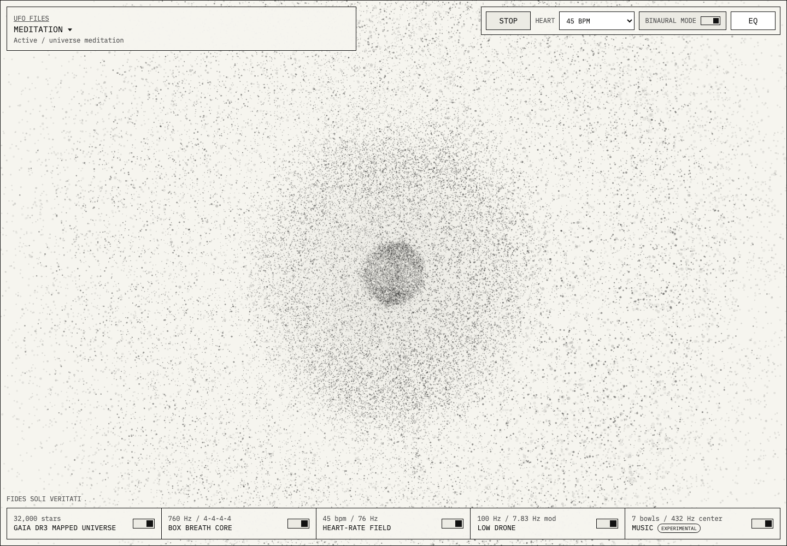

# UFO Files / Meditation

[](https://github.com/ufo-files/meditation/actions/workflows/pages.yml)
[](https://github.com/ufo-files/meditation/actions/workflows/screenshots.yml)

Meditation is a minimal Three.js visualizer that starts from real mapped-star data and layers meditation-oriented motion and sound structures over it.

Live app: https://ufo-files.github.io/meditation/

## Data

The universe layer is generated from Gaia DR3. The app ships a curated 32,000-star subset selected from bright sources with positive parallax, `parallax_over_error > 10`, and G-band photometry. Each point keeps Gaia-derived `source_id`, Cartesian `x`, `y`, `z`, visual magnitude, BP/RP color index, and distance in parsecs. The renderer preserves sky direction and log-compresses distance into a volumetric star field, so stars occupy the interior rather than only a surface shell.

Source: https://gea.esac.esa.int/archive/
Use terms: https://www.cosmos.esa.int/web/gaia-users/archive/conditions-of-use

The breath, beat, drone, and music layers are meditation overlays. They are not astronomical measurements. Box breathing stays fixed at a 16-second cycle; the heart-rate and music pulses use BPM options that divide evenly into that cycle.

## Screenshots



## Development

This is a static Pages app.

```sh
python3 -m http.server 4177
npm run build:universe
npm run screenshots
```
